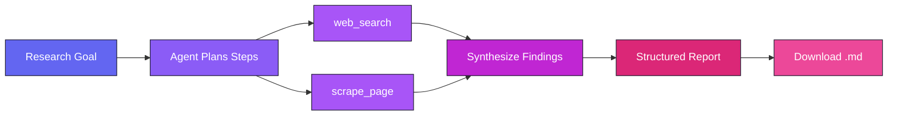

<div align="center">


<p>
  
  
  
</p>

<p>
  <a href="https://research-agent-python.streamlit.app/"><strong>Live Demo</strong></a> ·
  <a href="#getting-started"><strong>Getting Started</strong></a> ·
  <a href="#how-it-works"><strong>How It Works</strong></a> ·
  <a href="#screenshots"><strong>Screenshots</strong></a> ·
  <a href="#connect"><strong>Connect</strong></a>
</p>

</div>

<br/>

## Table of Contents

- [Overview](#overview)
- [Problem Statement](#problem-statement)
- [Solution](#solution)
- [Features](#features)
- [Tech Stack](#tech-stack)
- [How It Works](#how-it-works)
- [Getting Started](#getting-started)
- [Project Structure](#project-structure)
- [Screenshots](#screenshots)
- [Roadmap](#roadmap)
- [License](#license)
- [Connect](#connect)

<br/>

## Overview

**Autonomous Research Agent** turns a single, plain-English research goal into a fully-researched, structured report. Rather than answering from memory, the agent plans its own multi-step investigation, calls tools to search the web and scrape pages for ground-truth detail, and compiles its findings into a clean Markdown report — with its entire reasoning process visible in real time through a Streamlit interface.

> *"Analyze cybersecurity risks in cloud-based education platforms and propose mitigation strategies."*
> Give it a prompt like that, and it plans, researches, and writes the report on its own.

<br/>


## Problem Statement

Manual research is slow, repetitive, and hard to scale:

- Formulating the right search queries takes iteration and expertise
- Relevant information is scattered across dozens of tabs and sources
- More time goes into copy-pasting and skimming than actual analysis
- Turning scattered notes into one coherent, well-structured report is a separate task in itself
- The entire process has to be repeated from scratch for every new topic

For students, developers, analysts, and lifelong learners, this makes fast, thorough research disproportionately time-consuming.

<br/>

## Solution

Autonomous Research Agent automates the research pipeline end-to-end:

| Problem | How the agent solves it |
|---|---|
| Manual query planning | Breaks a single goal into the right sub-questions automatically |
| Scattered, shallow sources | Uses `web_search` + `scrape_page` to gather ground-truth content, not just snippets |
| No visibility into the process | Streams live agent reasoning so you see exactly what it searched and why |
| Disorganized notes | Synthesizes findings into a structured report — key findings, risks, recommendations, conclusion |
| No reusable output | Exports the final report as a downloadable Markdown file |

In short: you provide the question, the agent handles the investigation.

<br/>


## Features

<table>
<tr>
<td width="50%" valign="top">

**Goal-driven autonomy**
Give it one research goal — it plans and executes the rest.

**Live agent reasoning**
Every tool call is visible in the UI as it happens.

**Structured final reports**
Organized into clear, headed sections automatically.

</td>
<td width="50%" valign="top">

**Configurable depth**
A `Max Iterations` control decides how deep the agent digs.

**One-click export**
Download any report instantly as a `.md` file.

**Session history**
Revisit and compare past research runs.

</td>
</tr>
</table>

<br/>

## Tech Stack

<p>
  
  
  
  
  
  
</p>

<div align="center">

| Layer | Technology | Purpose |
|---|---|---|
| Reasoning / LLM | **Groq** | LPU-accelerated inference powering the agent's decisions |
| Orchestration | **LangChain** | Agent planning, tool routing, and execution loop |
| Interface | **Streamlit** | Interactive UI and live reasoning display |
| Research Tools | Web search & scraping utilities | Ground-truth data gathering |
| Output | Markdown | Structured, portable, exportable reports |
| Language | **Python 3.9+** | Core implementation |

</div>

<br/>


## How It Works



1. **Enter a research goal** describing what you want investigated.
2. **Run the agent** — it plans its own approach with no further input needed.
3. **Watch it work** — every `web_search` and `scrape_page` call streams live under *Agent Reasoning*.
4. **Review the report** — a structured, headed Markdown document is generated automatically.
5. **Export or revisit** — download the report as `.md`, or browse past runs from the session history.

<br/>

## Getting Started

### Prerequisites

- Python 3.9+
- A [Groq API key](https://console.groq.com/) (powers the agent's reasoning)
- API access for the web search / scraping tool used by the agent

### Installation

```bash
# 1. Clone the repository
git clone https://github.com/Amruta-Dabholkar/research-agent-python.git
cd research-agent-python

# 2. Install dependencies
pip install -r requirements.txt

# 3. Configure environment variables
cp .env.example .env   # then fill in your keys
```

`.env`
```env
GROQ_API_KEY=your_groq_api_key_here
# add any additional keys required by the web_search / scrape_page tools
```

### Run

```bash
streamlit run streamlit_app.py
```

Then open the local URL Streamlit provides — typically `http://localhost:8501`.

<br/>

## Project Structure

```
research-agent-python/
├── streamlit_app.py      # Streamlit UI entry point
├── agent/                # Agent logic, tools & orchestration
├── requirements.txt      # Python dependencies
├── .env.example           # Environment variable template
└── README.md
```

<br/>


## Screenshots

<div align="center">

**Live agent reasoning and tool calls**


<br/><br/>

**Structured final report**


<br/><br/>

**Recommendations, conclusion & export**


</div>

<br/>

## Roadmap

- [ ] Support for additional LLM providers
- [ ] PDF export alongside Markdown
- [ ] Source citation tracking within reports
- [ ] Multi-agent collaboration for larger research goals

<br/>

## License

Distributed under the **MIT License**. See [`LICENSE`](./LICENSE) for details.

Copyright © 2026 Amruta Anand Dabholkar

<br/>

<div align="center" id="connect">


<p>
  <a href="https://github.com/Amruta-Dabholkar/">
    
  </a>
  <a href="https://www.linkedin.com/in/amruta-dabholkar/">
    
  </a>
</p>

If this project was useful or interesting, consider giving it a star.

</div>
