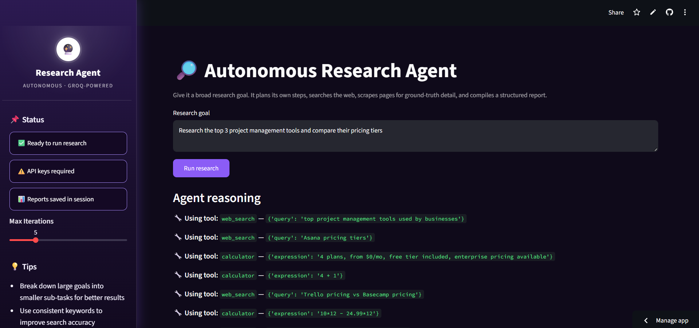
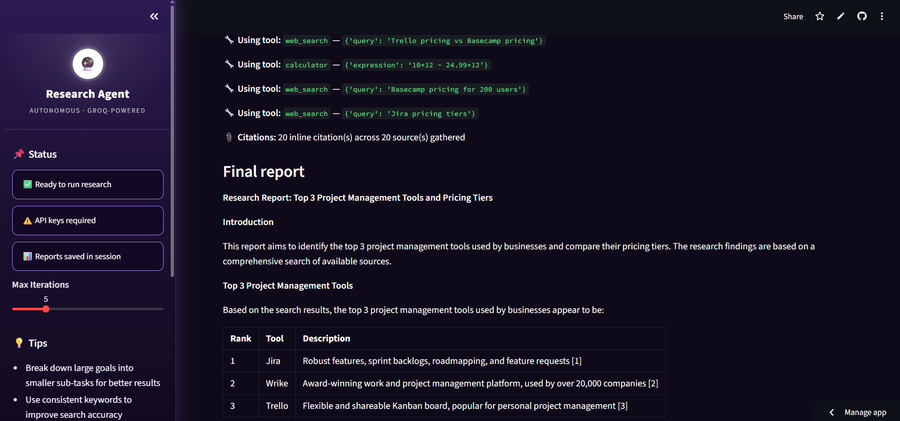
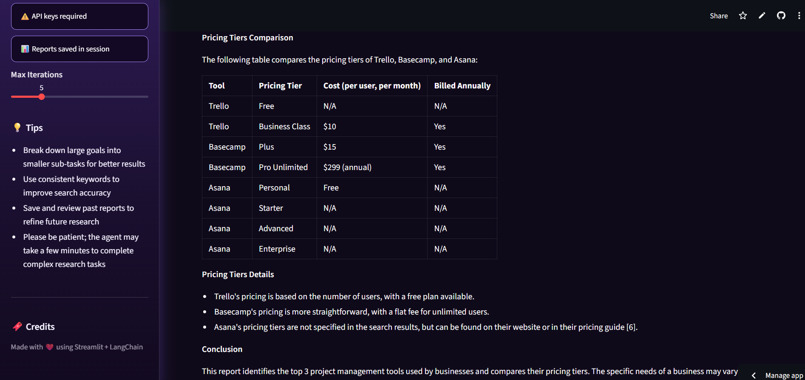
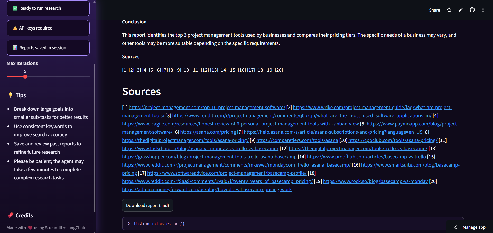

# 🤖🧠 Autonomous Research Agent

An autonomous research agent built with **LangChain** and **Groq**, wrapped in a **Streamlit** UI.

Give it a broad research goal — it plans its own sub-questions, researches each one independently, reflects on whether it has gathered enough evidence, and compiles everything into a structured Markdown report with headers, comparison tables, and sources — all without step-by-step guidance from the user.

This started as a from-scratch rebuild of an n8n AI Agent prototype: instead of relying on n8n's built-in agent node to hide the reasoning loop, every piece of the pipeline — planning, tool use, memory, failure handling, and stopping conditions — is wired up explicitly in code, so the whole system is visible, debuggable, and tunable.

🌐 **Live demo:** [research-agent-python.streamlit.app](https://research-agent-python.streamlit.app/)
---
🧑‍💻 **Author:** Amruta Dabholkar — 3rd Year Computer Engineering Student passionate about Data Science & AI. I believe in learning by doing — every concept I study gets coded, committed, and pushed here.
---

## 🧠How it works

Most "agent" projects are a single LLM stuck in a tool-calling loop until it decides to stop or runs out of steps. This one is structured differently, in four explicit phases:

```
   PLAN                EXECUTE                REFLECT              SYNTHESIZE
┌───────────┐     ┌─────────────────┐     ┌───────────────┐     ┌──────────────┐
│ Break the │────▶│ Research each   │────▶│ Enough         │────▶│ Write the    │
│ goal into │     │ sub-question    │     │ evidence to    │     │ final report │
│ 3-5 sub-  │     │ with a scoped   │     │ answer the     │     │ with a       │
│ questions │     │ tool-calling    │     │ goal?          │     │ Sources      │
│           │     │ agent           │     │                │     │ section      │
└───────────┘     └─────────────────┘     └───────┬────────┘     └──────────────┘
                                                     │ no, gaps found
                                                     ▼
                                          run 1-2 follow-up
                                          sub-questions, then
                                          reflect again
```

1. **Plan** — a dedicated LLM call decomposes the research goal into 3–5 concrete, independently-answerable sub-questions
2. **Execute** — each sub-question is handed to a small, scoped tool-calling agent (its own bounded iteration budget) that searches, scrapes, and returns a concise finding + the sources it used
3. **Reflect** — a dedicated LLM call reviews all findings against the *original* goal and decides: is this enough evidence to write a complete report, or are there real gaps? This is the actual stopping condition — not just "ran out of steps." If gaps are found, it proposes up to 2 follow-up sub-questions and loops once more.
4. **Synthesize** — once reflection is satisfied, a final LLM call writes the polished Markdown report from all gathered findings, with a Sources section listing every URL actually used

See `orchestrator.py` for the full implementation.

---

## ✨Features

- 🧭 **Explicit plan → execute → reflect → synthesize loop**, not a flat tool-calling loop with an arbitrary step limit as the only stopping condition
- 🔎 **Live web search** (DuckDuckGo, no API key required) and page scraping for grounded, non-fabricated data
- 🧮 Built-in calculator tool for numeric comparisons (pricing, percentages, totals)
- 🛡️ **Explicit failure handling**: automatic retries on timeouts/transient server errors, robots.txt compliance, paywall detection, and categorized error messages (404 vs. 403 vs. 429 vs. 5xx) so the agent can make a good decision about what to do next instead of hitting an opaque exception
- 📊 Structured Markdown reports with tables, downloadable from the UI
- 🎨 Custom-themed Streamlit interface showing live plan/reflection progress, not just raw tool calls
- 🗂️ Session history — past runs are saved and viewable within the current session for comparison
- ✅ **Measured, not just claimed** — see [Evaluation](#evaluation) below

---

## 🖥️ Using the app

1. Enter a **Research goal** describing what you want investigated (e.g. *"Analyze cybersecurity risks in cloud-based education platforms and propose mitigation strategies."*).
2. Click **Run research**.
3. Watch the agent plan and work through it autonomously, shown live under **Agent reasoning**:
   - `web_search` — queries the web for relevant sources
   - `scrape_page` — pulls detailed, ground-truth content from specific pages
4. A **Max Iterations** slider controls how many reasoning/tool-use steps the agent is allowed to take per sub-question (default: 10).
5. Once complete, a **Final report** is generated with headed sections and takeaways. Use **Download report (.md)** to save it locally, or expand **Past runs in this session** to revisit earlier reports.

---

## 📋Evaluation

Rather than just assert the agent "works," it's tested against a fixed set of **18 research queries** spanning three categories: factual (single checkable answer), comparative (requires synthesizing multiple sources), and ambiguous/open-ended (vague scope, no single correct answer).

| Metric | Result |
|---|---|
| **Completion rate** | 16/18 (89%) — finished without hitting the iteration limit or erroring out |
| **Avg latency** | 58.9s per report |
| **Avg distinct sources per report** | 7.9 |

Scoring on "did it actually answer the question" and "is it factually accurate" was done via LLM-judge (grading each report against the *actual* search/scrape evidence retrieved during that specific run, not the judge's own general knowledge), spot-checked manually against a sample of the raw transcripts.

Full per-query results, raw transcripts (including the complete tool-call trace for every run), and scoring methodology are in [`eval_results/`](eval_results/) — see [`eval_results/eval_results.md`](eval_results/eval_results.md) for the full breakdown and [`SCORING_GUIDE.md`](SCORING_GUIDE.md) for the rubric.

To reproduce:
```bash
python eval.py            # runs all 18 queries, saves transcripts + metrics
python auto_score.py      # LLM-judge scoring against each run's own evidence
python summarize_eval.py  # produces eval_results/eval_results.md
```

---

## ⚙️Tech stack

`Python` · `LangChain` · `Groq API` (`llama-3.1-8b-instant`) · `Streamlit` · `DuckDuckGo Search` · `BeautifulSoup`

---

## 📁Project structure

```
research_agent_python/
├── streamlit_app.py      # Streamlit UI — runs the orchestrator, shows live plan/reflection progress
├── orchestrator.py        # Plan → Execute → Reflect → Synthesize loop
├── agent.py                # Tool-calling agent builders (full-report mode + scoped subtask mode)
├── tools.py                 # web_search, scrape_page, calculator — with retries & robots.txt compliance
├── eval.py                    # Runs the 18-query test set, logs automated metrics
├── auto_score.py                # LLM-judge scoring against each run's captured evidence
├── summarize_eval.py              # Aggregates eval_results/results.csv into the final report
├── SCORING_GUIDE.md                 # Manual scoring rubric
├── eval_results/                      # Raw transcripts + metrics from the latest eval run
├── screenshots/                         # UI screenshots used in this README
├── requirements.txt
└── .env.example
```

---

## ⚡Setup

1. Clone the repo and install dependencies:
   ```bash
   git clone https://github.com/Amruta-Dabholkar/research-agent-python.git
   cd research-agent-python
   pip install -r requirements.txt
   ```
2. Copy `.env.example` to `.env` and add your Groq API key:
   ```
   GROQ_API_KEY=your-key-here
   ```
   (Web search runs on DuckDuckGo and needs no API key. If you have a SerpAPI key and want Google-quality results instead, see the commented-out alternative in `tools.py`.)
3. Run the app:
   ```bash
   streamlit run streamlit_app.py
   ```
   Then open the local URL Streamlit provides (usually `http://localhost:8501`) in your browser.

   Or use the CLI directly:
   ```bash
   python agent.py
   ```

> ⚠️ The app will show an **"API keys required"** status until a valid Groq API key is configured.

---

## 📸 Screenshots


***Agent input and live tool calls***



***Final report — introduction***



***Pricing comparison table in the generated report***



***Sources section and report download***



---

## 💡 Tips for best results

- **Break down large goals** into smaller, focused research questions for better results.
- **Use consistent keywords** in your research goal to improve search accuracy.
- **Save and review past reports** to refine future research prompts.
- **Be patient** — complex research tasks may take the agent a minute or two to complete.

---

## 📜Engineering notes / known limitations

Being upfront about the rough edges, since that's more useful than pretending there aren't any:

- **DuckDuckGo search quality** is generally a notch below Google (via SerpAPI) — fewer results for niche queries, occasionally less authoritative sources. Chosen here because it needs no API key or quota, so anyone cloning this repo can run it immediately.
- **LLM-judge scoring** is a faster substitute for full manual review, not a replacement for it. It's a real check (graded against each run's actual retrieved evidence, not the judge's general knowledge) but should be spot-checked by a human before treating the numbers as final — see `SCORING_GUIDE.md`.
- **`llama-3.1-8b-instant`** is a small, fast model chosen for cost/latency — a larger model would likely improve the 2/18 incomplete-run rate and factual accuracy scores at the cost of latency.
- No caching yet — repeated searches/scrapes within a session re-fetch rather than reuse. On the roadmap.

## 📅Roadmap

- [x] Automated evaluation harness with honest, measured completion/accuracy numbers
- [x] Explicit plan → execute → reflect loop with a real stopping condition
- [x] Explicit failure handling — retries, robots.txt compliance, categorized errors
- [x] Citation tracking — map individual claims in the report back to specific source URLs, not just a general source list
- [ ] Caching for repeated searches/scrapes within a session
- [ ] Unit tests for tools (mocked responses) + CI on push

---
---

## 🌱 Daily Habit

- 📝 Study 2 topics daily (2 hrs each)
- 💻 Code every concept, don't just read
- 🟩 Push to GitHub every single day
- 🔗 Document progress on LinkedIn

---

## 🔗 Connect

[](https://www.linkedin.com/in/amruta-dabholkar-2a51a4378/)
[](https://github.com/Amruta-Dabholkar)

---

## ❤️ Credits

Made with Streamlit + LangChain, powered by Groq.

## 📄License

This project is licensed under the [MIT License](LICENSE) — see the [`LICENSE`](LICENSE) file for details.

Copyright (c) 2026 Amruta Anand Dabholkar
