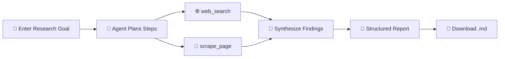

<div align="center">

# 🔍 Autonomous Research Agent

### An AI agent that plans, searches, scrapes & writes research reports — all on its own.

<p>
  
  
  
  
</p>

<p>
  <a href="https://research-agent-python.streamlit.app/"><strong>🚀 Live Demo</strong></a>
  ·
  <a href="#-setup">⚙️ Setup</a>
  ·
  <a href="#-how-it-works">🖥️ How It Works</a>
  ·
  <a href="#-screenshots">📸 Screenshots</a>
</p>

</div>

<br/>

## 🧠 About

**Autonomous Research Agent** takes a single, plain-English research goal and runs with it. It plans its own multi-step investigation, searches the web, scrapes pages for ground-truth detail, and compiles everything into a clean, structured Markdown report — with a live view of its own reasoning as it works, all wrapped in a simple Streamlit UI.

> 💬 *"Analyze cybersecurity risks in cloud-based education platforms and propose mitigation strategies."* — give it a goal like that, and watch it think.

<br/>

## ✨ Features

| | |
|---|---|
| 🎯 **Goal-driven autonomy** | Give it one research goal — it breaks it into sub-tasks on its own |
| 🧩 **Live agent reasoning** | Watch every tool call (`web_search`, `scrape_page`) as it happens |
| 📄 **Structured final report** | Auto-compiled into Introduction, Key Risks, Mitigation, Conclusion & more |
| 🎚️ **Configurable iteration limit** | A `Max Iterations` slider controls how deep the agent digs (default: 10) |
| 💾 **Exportable reports** | Download any report instantly as a `.md` file |
| 🕓 **Session history** | Revisit and compare past runs within the same session |

<br/>

## 🛠️ Tech Stack

<p>
  
  
  
  
  
  
</p>

<div align="center">

| Layer | Technology |
|---|---|
| 🧠 Reasoning / LLM | **Groq** (LPU-accelerated inference) |
| 🔗 Agent Orchestration | **LangChain** |
| 🎨 Frontend / UI | **Streamlit** |
| 🌐 Research Tools | Web search & page scraping utilities |
| 📝 Output | Structured **Markdown** reports |
| 🐍 Language | **Python 3.9+** |

</div>

<br/>

## 🖥️ How It Works



1. Enter a **research goal** describing what you want investigated.
2. Click **Run research**.
3. The agent plans and works autonomously — visible live under **Agent reasoning**:
   - `web_search` → queries the web for relevant sources
   - `scrape_page` → pulls ground-truth content from specific pages
4. A **Final report** is generated with headed sections and takeaways.
5. **Download report (.md)**, or revisit **Past runs** from the same session.

<br/>

## ⚙️ Requirements

- 🐍 Python 3.9+
- [Streamlit](https://streamlit.io/)
- [LangChain](https://www.langchain.com/)
- 🔑 A **Groq API key** (powers the agent's reasoning)
- 🔑 A web search / scraping API key or service

> ⚠️ The app displays an **"API keys required"** status until valid keys are configured.

<br/>

## 🔑 Setup

**1. Clone the repository**
```bash
git clone https://github.com/Amruta-Dabholkar/research-agent-python.git
cd research-agent-python
```

**2. Install dependencies**
```bash
pip install -r requirements.txt
```

**3. Configure your API keys** — via `.env` or Streamlit secrets:
```env
GROQ_API_KEY=your_groq_api_key_here
# add any additional keys required for web_search / scrape_page tools
```

**4. Run the app**
```bash
streamlit run streamlit_app.py
```

**5.** Open the local URL Streamlit provides — usually `http://localhost:8501` 🎉

<br/>

## 📸 Screenshots

<div align="center">

**🧩 Agentic workflow — live reasoning and tool calls**


<br/><br/>

**📊 Structured final report**


<br/><br/>

**✅ Mitigation strategies, conclusion & export**


</div>

<br/>

## 💡 Tips for Best Results

- 🎯 **Break down large goals** into smaller, focused sub-tasks
- 🔍 **Use consistent keywords** to improve search accuracy
- 🗂️ **Save and review past reports** to refine future prompts
- ⏳ **Be patient** — complex research may take a few minutes

<br/>

## 📦 Output Format

Reports are compiled in structured Markdown, typically including:

- 📖 **Introduction** — framing of the research topic
- 🔎 **Core Findings** — numbered, bolded points with explanations
- 🛡️ **Recommendations / Mitigation Strategies** — actionable next steps
- ✅ **Conclusion** — summary tying findings back to the original goal

<br/>

## ❤️ Credits

Made with **Streamlit** + **LangChain**, powered by **Groq**.

## 📄 License

Licensed under the **MIT License** — see [LICENSE](./LICENSE) for details.

Copyright © 2026 Amruta Anand Dabholkar

<br/>

---

<div align="center">

### 👩‍💻 Author: Amruta Dabholkar

<p>
  <a href="https://github.com/Amruta-Dabholkar/">
    
  </a>
  <a href="https://www.linkedin.com/in/amruta-dabholkar/">
    
  </a>
</p>

⭐ If you found this project interesting, consider giving it a star!

</div>
